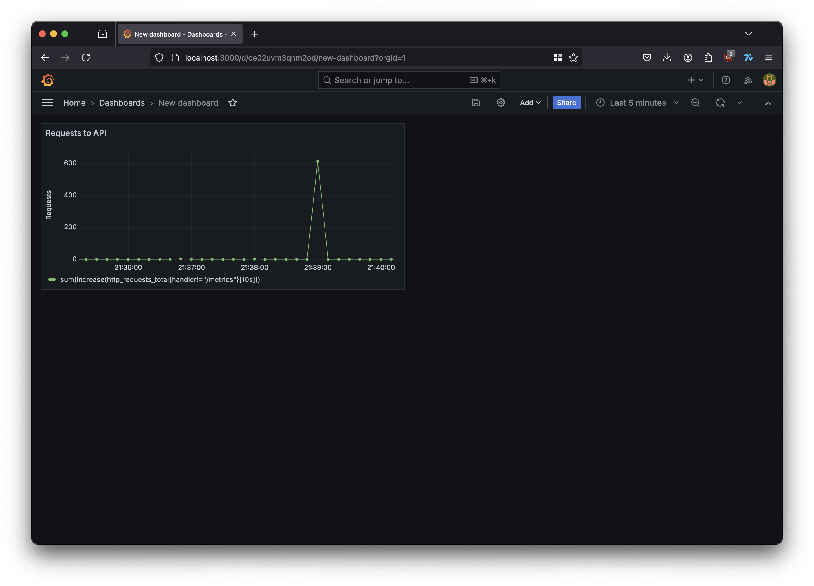

# HSE Python Backend Course


## ITMO Student
### Daniel Kopecky (`282306`)


## HW#2
#### To run tests in docker:
```bash
make docker-test
```

#### To run tests locally:
```bash
make test
```
> **P.S.**  
> You can also see the test report in GitHub CI

## HW#3
#### To run server with monitoring services
```bash
docker compose up -d
```

#### Example Grafana Dashboard with Requests to API Visualization
